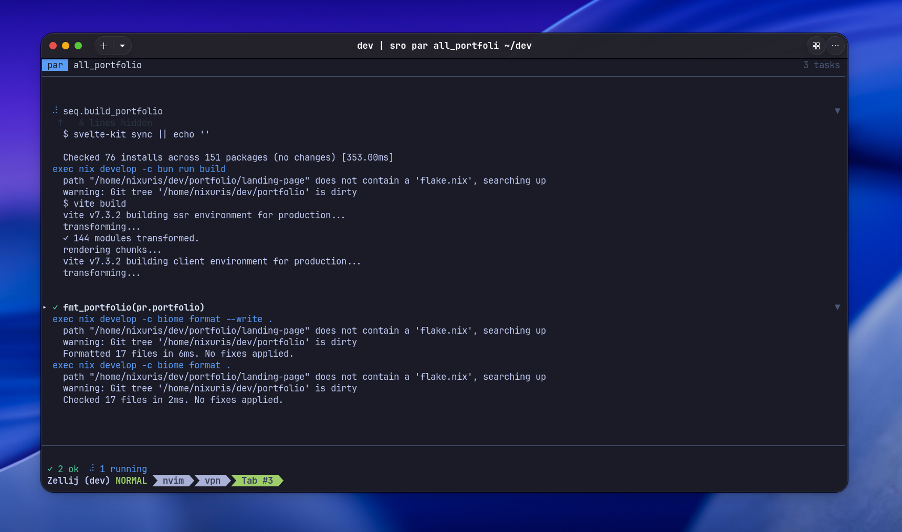

<h1 align="center">Serein Repository Orchestrator</h1>
<p align="center">A declarative multi-repo workspace orchestrator with its own DSL, execution engine, and live TUI.</p>
<p align="center">
    <a href="LICENSE"></a>
    <a href="https://github.com/infraflakes/sro/releases"></a>
</p>



> [!CAUTION]
> Main development happens on [Gitlab](https://gitlab.com/infraflakes/sro).
>
> The [Github repository](https://github.com/infraflakes/sro) is just a mirror!

---

## The problem

You switch machines. You have fifteen repos. You have a different setup script per project, a makefile that forgets `cd` between lines, env vars leaking everywhere, and a shell script graveyard nobody trusts.

`sro` fixes this with a single config file, a small DSL, and zero shell archaeology.

---

## Concepts

**`sanctuary`** — your master workspace directory. all repos live relative to it.

**`pr`** — a project declaration. url, local dir, sync behavior, optional per-project config.

**`fn`** — a named execution block scoped to a project directory. primitives never leak between blocks.

**`seq`** — runs fn calls sequentially. stops everything on first failure.

**`par`** — runs fn calls concurrently. failures are isolated, others continue.

---

## Usage

```
sro sync                       clone all declared repos into sanctuary
sro seq <name>                 run a sequential block, fail-fast
sro par <name>                 run a parallel block, isolated failures
sro -c <path> <command>        use a custom config file
sro --config <path> <command>  same as -c
```

Config is discovered at `~/.config/sro/config.sro` by default. Override with `-c`.

---

## Config

Everything lives in one `.sro` file — project declarations, execution logic, variables. No separate config and script files.

For example:

```
shell = `bash`; # this argument is mandatory if you want to use shell related features! You can choose whatever shell you like.

var shell workdir = `echo $HOME/dev`; # Define a shell variable which returns value
var string app    = `todo`; # Define a string variable

sanctuary = $workdir; # Referencing variable with `$`

pr todo { # project field to define project properties
    url  = `git@github.com:yourname/todo.git`;
    dir  = `todo`; # project will be cloned on path relative to sanctuary, in this case `$HOME/dev/todo`.
    sync = `clone`; # affects how `sync` works, `clone` will clone the project, `ignore` will neglect.
}

pr calendar {
    url  = `git@github.com:yourname/calendar.git`;
    dir  = `calendar`;
    sync = `clone`;
    use  = `.sro/main.sro`;
}

fn build {
    var shell version = `git describe --tags --always --dirty 2>/dev/null || echo dev`;
    cd(`cmd`); # `cd()` always map to sanctuary/project_dir, meaning `cd(`.`)` will always return to project's root.
    env [CGO_ENABLED = `0`, GOOS = `linux`] {
        exec(`go build -ldflags='-X main.version=${version}' -o bin/${app} .`);
    };
}

fn test {
    env [CGO_ENABLED = `0`] {
        exec(`go test -race ./...`);
        exec(`go vet ./...`);
    };
}

seq release {
    test(todo);
    build(todo);
}

par ci {
    build(todo);
    build(calendar);
    seq.release;
}
```

---

## DSL reference

### Declarations

| declaration | description |
|-------------|-------------|
| `shell = \`...\`;` | required, must be first. declares the shell for `exec` and `var shell` |
| `sanctuary = \`...\` \| $var;` | required. absolute path to workspace root |
| `var string name = \`...\` \| $var;` | string variable, global or fn-scoped |
| `var shell name = \`...\`;` | runs content via declared shell, stores stdout |
| `import ./path;` | import other `.sro` files, relative paths only |
| `pr name { ... }` | project declaration |
| `fn name { ... }` | execution block |
| `seq name { ... }` | sequential orchestration block |
| `par name { ... }` | parallel orchestration block |

### Project fields

| field | required | description |
|-------|----------|-------------|
| `url` | yes | git clone url |
| `dir` | yes | directory name relative to sanctuary, must be unique |
| `sync` | no | `clone` (default) — skip if exists. `ignore` — skip entirely |
| `use` | no | path to a `.sro` file inside the project, relative to project dir |
| `branch` | no | branch to clone. defaults to repo default branch |

### fn primitives

| primitive | description |
|-----------|-------------|
| `exec(\`...\`);` | run command via declared shell. non-zero exit fails the block |
| `cd(\`...\`);` | change cwd relative to project dir. cannot escape project dir |
| `log(\`...\`);` | print to TUI output. never fails |
| `env [...] { };` | scoped env vars. inner `env` overrides outer. no leakage |
| `var <type> name = ...;` | fn-local variable. shadows global with same name |

### seq and par body

| statement | description |
|-----------|-------------|
| `fnname(project);` | call fn with project as cwd context |
| `seq.name;` | reference another seq block |

`par.name` cannot be referenced — par blocks are CLI entry points only.

### Types and values

| syntax | type | notes |
|--------|------|-------|
| `` `...` `` | string | use `${name}` to interpolate variables |
| `$name` | var ref | standalone reference, outside backticks |
| integer | number | whole numbers only |

### Delimiter rules

| delimiter | job |
|-----------|-----|
| `()` | primitive args — `exec()`, `cd()`, `log()` |
| `[]` | typed list — `env[]` |
| `{}` | statement block |
| `;` | statement terminator inside `{}` |
| `,` | item separator inside `[]` |

### Rules

- `shell` must be declared before any `exec`, `var shell`, or `fn`.
- `sanctuary` must be declared before any `pr`.
- variables must be declared before they are referenced.
- `cd` cannot escape the project directory. hard fail at runtime.
- `override fn` is required to redefine a global `fn` in a `use` file. silent redeclaration is a parse error.
- circular imports fail at parse time.
- two projects cannot share the same `dir`. parse error.
- `par.name` references are not allowed inside `seq` or `par` bodies.

---

## Per-project config

If a project declares `use`, that file is parsed after `sro sync` clones the repo. It can define or `override` global fns. It cannot declare `sanctuary`, `pr`, or `shell`.

```
# calendar/.sro/main.sro

override fn build {
    exec(`pnpm build`);
}

fn dev {
    exec(`pnpm dev`);
}
```

---

## TUI

`sro` renders a live accordion TUI during execution. each task has a colored left bar indicating status, expandable stdout, and pruned history for long output.

```
par  ci                                                3 tasks

 ✓  build(todo)                                          ▶
 ⠋  build(calendar)                                      ▼
    log  Building project...
    var  version = 3a1b2c4
    env  CGO_ENABLED=0 GOOS=linux
    exec go build -ldflags='-X main.version=3a1b2c4' -o bin/todo .
    ⠋
 ✓  seq.release                                             ▶

✓ 2 ok  ⠋ 1 running
```

---

## Contributing

Contributions are welcome! Feel free to open issues or submit pull requests.

## License

[MIT](./LICENSE)
